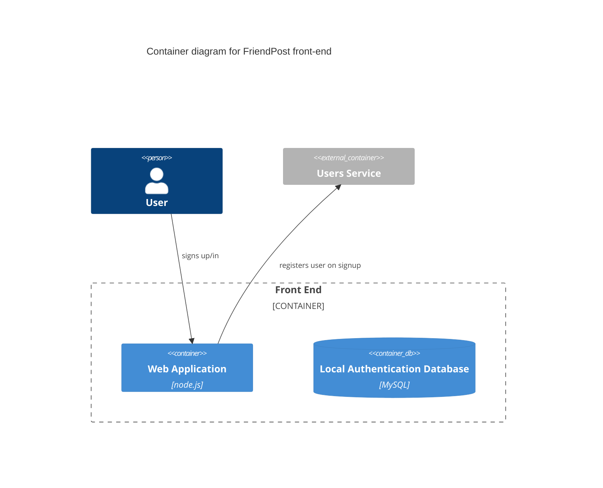

# webapplication

The Web Application front-end for the FriendPost application

## C4 Container diagram

```mermaid
C4Container
title Container diagram for FriendPost front-end

Person(user1, "User")

Container_Boundary(frontend, "Front End") {
    Container(nodeapp, "Web Application","node.js")
    ContainerDb(authdb, "Local Authentication Database", "MySQL")
}

Container_Ext(usersservice,"Users Service")

Rel(user1, nodeapp, "signs up/in")
Rel(nodeapp, usersservice, "registers user on signup")

UpdateRelStyle(user1, nodeapp, $offsetY="-40")
```